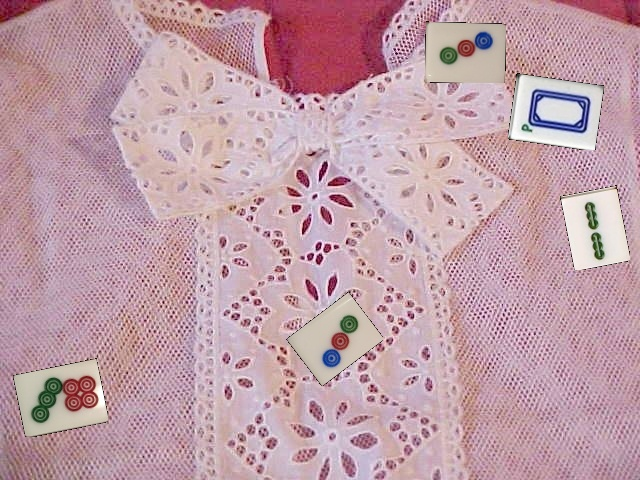
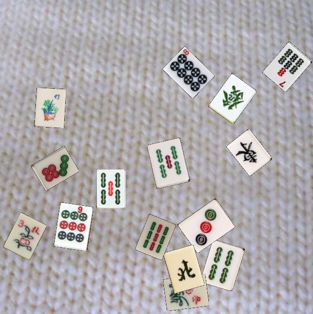
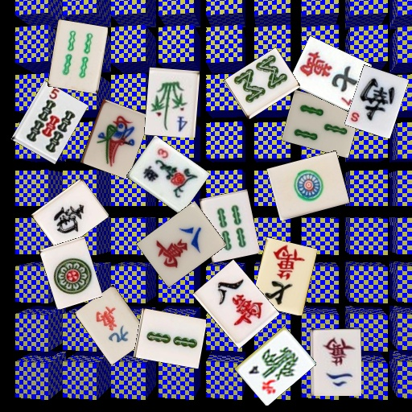
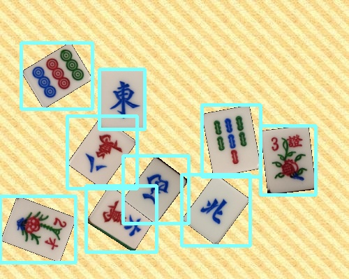

# Mahjong Dataset Augmentation

## Introduction
* The application could generate image datasets of Chinese Mahjong tiles, with tens of thousands of images and annotations in VOC2007 dataset format (you can edit it to generate other dataset format easily).
* The application uses *Python* and *OpenCV* to generates images where rotated mahjong tiles are placed on a random background.

These Images are equipped with correct annotation (in `outputs` directory), here's a example. 

## Credits
* Mahjong Dataset Augmentation by *HSKPeter* ([Link](https://github.com/HSKPeter/mahjong-dataset-augmentation))
* Describable Textures Dataset ([Link](https://www.robots.ox.ac.uk/~vgg/data/dtd/))
* Mahjong Dataset created by *Camerash* ([Link](https://github.com/Camerash/mahjong-dataset))
